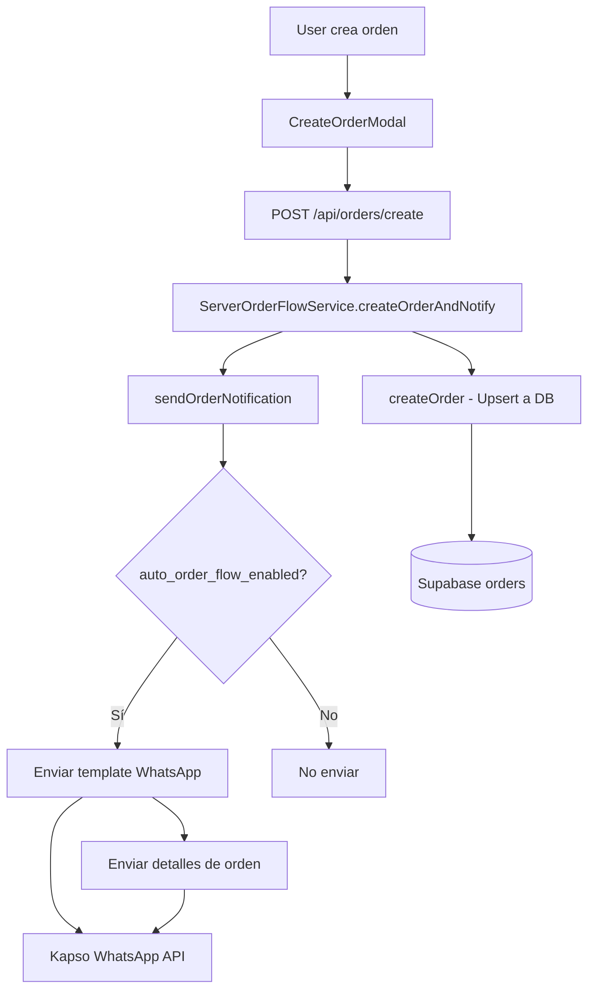
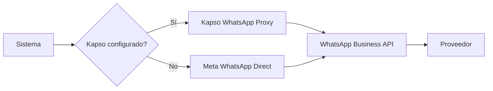
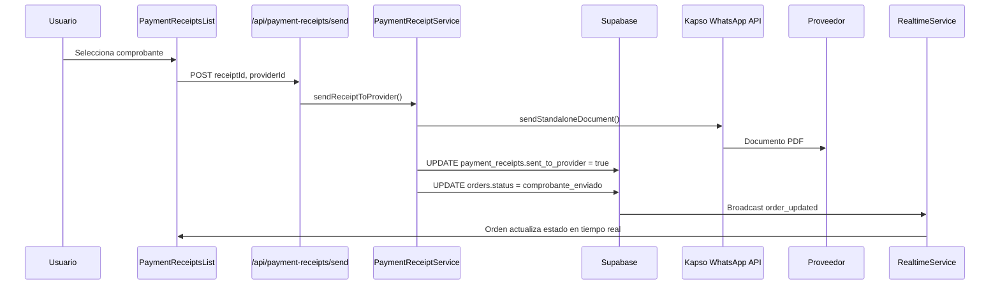
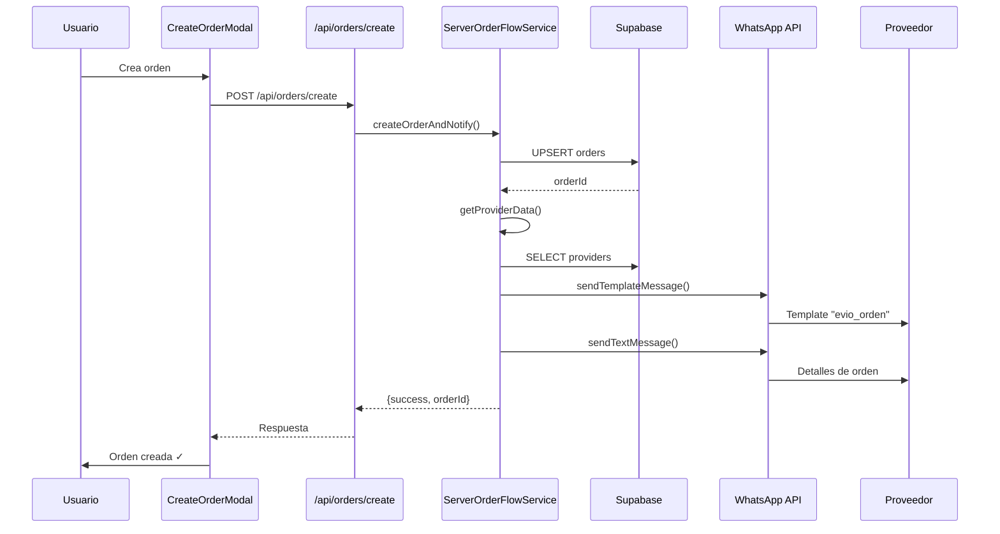
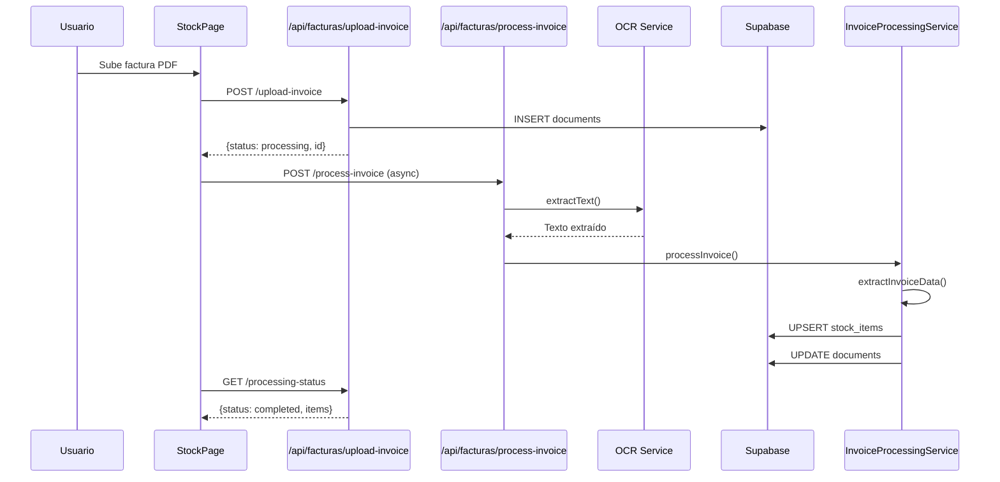
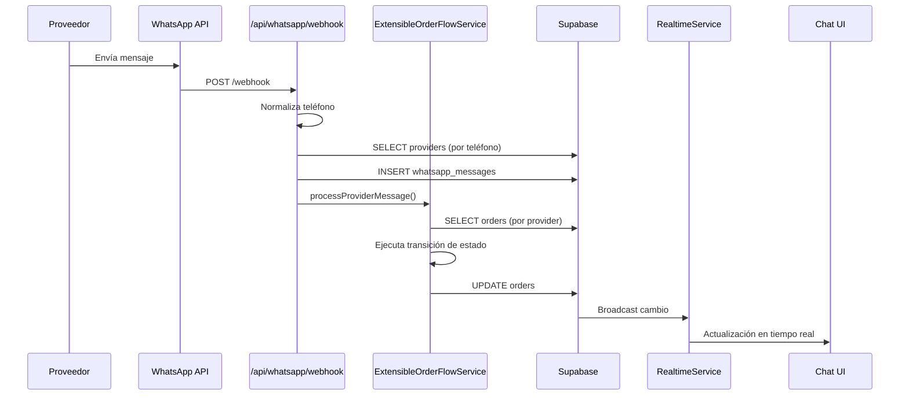

# 🧭 MAPA MADRE ADAPTATIVO - GASTRONOMY SAAS

**Fecha de última actualización:** 2025-11-07  
**Versión:** 2.1  
**Estado:** 🟩 Estable y Documentado  
**Metodología:** Revisión completa y documentación matemáticamente precisa

---

## 📐 DEFINICIÓN FORMAL DEL SISTEMA

### **Tupla de Componentes Principales**

Sea el sistema **G** = (F, B, D, I, C) donde:

- **F** = Frontend (React + Next.js App Router)
- **B** = Backend (Next.js API Routes + Supabase)
- **D** = Database (PostgreSQL vía Supabase)
- **I** = Integraciones Externas (Kapso, Meta WhatsApp, OCR)
- **C** = Capas de Comunicación (Realtime, Webhooks, API REST)

### **Función de Estado del Sistema**

Para cada módulo **m** ∈ M (conjunto de módulos), definimos:

```
Estado(m) = {
  🟩 Estable       si: tests ✓, uso activo ✓, sin errores conocidos
  🟨 Revisión      si: funcional pero requiere optimización/documentación
  🟥 Incierto      si: errores conocidos o dependencias problemáticas
  🟦 Indeterminado  si: no hay suficiente información para evaluar
}
```

---

## 🧠 STACK TECNOLÓGICO

### **Frontend Layer (F)**

| Componente | Versión | Estado | Confiabilidad |
|------------|---------|--------|---------------|
| Next.js (App Router) | 14.0.4 | 🟩 | 100% |
| React | 18.x | 🟩 | 100% |
| TypeScript | 5.x | 🟩 | 100% |
| Tailwind CSS | 3.3.0 | 🟩 | 100% |
| TanStack Table | 8.10.7 | 🟩 | 100% |
| React Hook Form | 7.48.2 | 🟩 | 100% |
| Zod | 3.22.4 | 🟩 | 100% |

### **Backend Layer (B)**

| Componente | Versión | Estado | Confiabilidad |
|------------|---------|--------|---------------|
| Next.js API Routes | 14.0.4 | 🟩 | 100% |
| Supabase Client | 2.52.1 | 🟩 | 100% |
| Node.js Runtime | LTS | 🟩 | 100% |

### **Database Layer (D)**

| Componente | Versión | Estado | Confiabilidad |
|------------|---------|--------|---------------|
| PostgreSQL (Supabase) | Latest | 🟩 | 100% |
| Supabase Realtime | 2.52.1 | 🟨 | 95% |
| Row Level Security | Enabled | 🟩 | 100% |

### **Integration Layer (I)**

| Componente | Estado | Confiabilidad | Notas |
|------------|--------|---------------|-------|
| Kapso WhatsApp API | 🟩 | 98% | Integración completa y estable |
| Kapso Platform API | 🟩 | 95% | Onboarding funcional |
| Meta WhatsApp Business API | 🟨 | 85% | Requiere configuración manual de webhooks |
| Tesseract.js (OCR) | 🟨 | 90% | Funcional pero puede mejorar |
| PDF-Parse | 🟩 | 95% | Estable |

---

## ⚙️ MAPEO ESTRUCTURAL FORMAL

### **Árbol de Directorios Principal**

```
G = gastronomy-saas/
├── src/
│   ├── app/                    # Next.js App Router (Páginas y APIs)
│   │   ├── api/                # API Endpoints (Backend)
│   │   │   ├── admin/          # 🟨 Administración (1 endpoint)
│   │   │   ├── debug/          # 🟥 Debugging (31 endpoints - desarrollo)
│   │   │   ├── documents/      # 🟩 Gestión de documentos (2 endpoints)
│   │   │   ├── facturas/       # 🟩 Procesamiento de facturas (10 endpoints)
│   │   │   ├── kapso/          # 🟩 Integración Kapso (20 endpoints)
│   │   │   │   ├── platform/   # 🟩 Platform API (onboarding)
│   │   │   │   └── whatsapp/   # 🟩 WhatsApp Proxy API
│   │   │   ├── orders/         # 🟩 Gestión de órdenes (4 endpoints)
│   │   │   ├── payment-receipts/ # 🟩 Comprobantes de pago (3 endpoints)
│   │   │   ├── providers/      # 🟩 Proveedores (1 endpoint)
│   │   │   ├── user/           # 🟩 Gestión de usuarios (3 endpoints)
│   │   │   └── whatsapp/      # 🟩 WhatsApp Business API (45 endpoints)
│   │   ├── auth/               # 🟩 Autenticación (6 páginas)
│   │   ├── dashboard/          # 🟩 Panel principal
│   │   ├── orders/             # 🟩 Gestión de órdenes
│   │   ├── providers/          # 🟩 Gestión de proveedores
│   │   ├── stock/              # 🟩 Gestión de inventario
│   │   ├── chat/               # 🟩 Chat WhatsApp
│   │   ├── kapso-integration/  # 🟩 Integración Kapso (onboarding)
│   │   └── layout.tsx          # 🟩 Layout raíz
│   ├── components/             # Componentes React reutilizables
│   │   ├── DataGrid/           # 🟩 Tabla de datos genérica
│   │   ├── AuthLayout.tsx       # 🟩 Layout de autenticación
│   │   ├── CreateOrderModal.tsx # 🟩 Modal de creación de órdenes
│   │   ├── EditOrderModal.tsx   # 🟩 Modal de edición de órdenes
│   │   ├── DataProvider.tsx     # 🟩 Provider de datos globales
│   │   ├── Navigation.tsx       # 🟩 Navegación principal
│   │   ├── InvoiceManagementSystem.tsx # 🟩 Sistema de facturas
│   │   ├── KapsoInbox.tsx       # 🟩 WhatsApp Inbox de Kapso
│   │   ├── CustomerOnboarding.tsx # 🟩 Onboarding de clientes
│   │   └── [28 componentes más] # 🟩 Todos estables
│   ├── lib/                     # Servicios y utilidades
│   │   ├── supabase/            # 🟩 Clientes Supabase (5 archivos)
│   │   ├── serverOrderFlowService.ts # 🟩 Flujo de órdenes (servidor)
│   │   ├── extensibleOrderFlowService.ts # 🟩 Flujo extensible de órdenes
│   │   ├── whatsappTemplateSetupService.ts # 🟩 Configuración de templates
│   │   ├── documentService.ts   # 🟩 Gestión de documentos
│   │   ├── kapsoPlatformService.ts # 🟩 Platform API service
│   │   ├── kapsoService.ts      # 🟩 Kapso service (legacy)
│   │   ├── kapsoWhatsAppProxyService.ts # 🟩 WhatsApp Proxy service
│   │   ├── metaWhatsAppService.ts # 🟨 Meta WhatsApp service
│   │   ├── ocrService.js        # 🟨 Servicio OCR
│   │   ├── phoneNumberService.ts # 🟩 Normalización de teléfonos
│   │   ├── invoiceProcessingService.ts # 🟩 Procesamiento de facturas
│   │   ├── invoiceValidationService.ts # 🟩 Validación de facturas
│   │   └── [20+ servicios más] # 🟩/🟨 Varios
│   ├── services/                # Servicios de React
│   │   └── realtimeService.tsx  # 🟩 Servicio de tiempo real
│   ├── hooks/                   # Custom Hooks
│   │   ├── useSupabaseAuth.ts   # 🟩 Autenticación
│   │   ├── useWhatsAppConfig.ts # 🟩 Configuración WhatsApp
│   │   ├── useAutoOCR.ts        # 🟩 OCR automático
│   │   ├── usePaymentReceipts.ts # 🟩 Comprobantes de pago
│   │   └── [5 hooks más]       # 🟩 Todos estables
│   ├── types/                   # Definiciones de tipos TypeScript
│   │   ├── index.ts             # 🟩 Tipos principales
│   │   ├── documents.ts         # 🟩 Tipos de documentos
│   │   └── whatsapp.ts          # 🟩 Tipos de WhatsApp
│   └── locales/                 # Internacionalización
│       └── es.ts                # 🟩 Español
└── docs/                        # Documentación técnica
    ├── MAPA_MADRE_ADAPTATIVO.md # 🟩 Este documento
    └── [30+ documentos más]     # 🟩 Documentación técnica
```

---

## 🧠 MAPEO FUNCIONAL POR CAPAS

### **1. Capa de Presentación (UI Layer)**

#### **Componentes Principales**

| Componente | Props | Estado | Responsabilidad |
|------------|-------|--------|-----------------|
| `DashboardPage` | `user` | 🟩 | Vista principal del sistema |
| `OrdersPage` | `user` | 🟩 | Gestión de órdenes |
| `ProvidersPage` | `user` | 🟩 | Gestión de proveedores |
| `StockPage` | `user` | 🟩 | Gestión de inventario |
| `CreateOrderModal` | `isOpen`, `onClose`, `onSubmit`, `providers`, `stockItems`, `orders` | 🟩 | Crear nuevas órdenes |
| `EditOrderModal` | `isOpen`, `onClose`, `order`, `onUpdate` | 🟩 | Editar órdenes existentes |
| `DataProvider` | `userEmail`, `userId`, `children` | 🟩 | Contexto global de datos |
| `Navigation` | - | 🟩 | Navegación principal |
| `InvoiceManagementSystem` | - | 🟩 | Sistema de facturas |
| `PaymentReceiptsList` | `userId`, `orders`, `hideHeader` | 🟩 | Gestión masiva de comprobantes con envío automatizado |
| `OrdersModule` | `orders`, `providers`, callbacks | 🟩 | Listado resumido con acceso directo a comprobantes |

**Flujo de Datos UI:**
```
User Action → Component → DataProvider → API → Database
```

---

### **2. Capa de Lógica de Negocio (Business Logic Layer)**

#### **Servicios Principales**

| Servicio | Métodos Clave | Estado | Dependencias |
|----------|---------------|--------|--------------|
| `ServerOrderFlowService` | `createOrderAndNotify`, `createOrder`, `sendOrderNotification` | 🟩 | Supabase, Meta WhatsApp |
| `ExtensibleOrderFlowService` | `processProviderMessage`, `executeTransition` | 🟩 | Supabase, Kapso |
| `PaymentReceiptService` | `processPaymentReceipt`, `sendReceiptToProvider` | 🟩 | Supabase, Kapso |
| `WhatsAppTemplateSetupService` | `setupTemplatesForUser`, `createTemplate`, `getExistingTemplates` | 🟩 | Kapso API, Supabase |
| `DocumentService` | `createDocument`, `processDocument`, `assignToProvider` | 🟩 | Supabase, OCR Service |
| `InvoiceProcessingService` | `processInvoice`, `extractInvoiceData` | 🟩 | PDF-Parse, OCR, Supabase |
| `PhoneNumberService` | `normalizePhone`, `validatePhone` | 🟩 | Regex, Validación |

**Flujo de Creación de Orden:**


---

#### **Máquina de Estados de Órdenes**

| Estado | Activa `ExtensibleOrderFlowService` | Trigger | Acción asociada | Estado siguiente |
|--------|-------------------------------------|---------|-----------------|------------------|
| `standby` | Sí | Cualquier mensaje del proveedor | `send_order_details` (en Kapso) | `enviado` |
| `enviado` | Sí | `documento_recibido` (webhook/documento) | `process_invoice` | `pendiente_de_pago` |
| `pendiente_de_pago` | Sí (manual) | Carga de comprobante (usuario) | `complete_order` | `pagado` |
| `pagado` | Sí | Envío de comprobante al proveedor | Notificación final | `comprobante_enviado` |
| `comprobante_enviado` | No | — | Estado terminal | — |

- El servicio normaliza estados legacy antes de transicionar (`normalizeOrderStatus`).  
- Transiciones se ejecutan vía `executeTransition`, que actualiza Supabase y emite broadcast `orders-updates`.  
- `PaymentReceiptService.sendReceiptToProvider` fuerza la transición `pagado → comprobante_enviado` tras confirmar entrega del comprobante y también emite broadcast.

---

### **3. Capa de Integración (Integration Layer)**

#### **Integraciones Externas**

| Integración | Endpoint/Service | Estado | Autenticación |
|-------------|------------------|--------|---------------|
| **Kapso WhatsApp API** | `kapsoWhatsAppProxyService` | 🟩 | API Key + Kapso Config ID |
| **Kapso Platform API** | `kapsoPlatformService` | 🟩 | API Key |
| **Meta WhatsApp Business** | `metaWhatsAppService` | 🟨 | Access Token |
| **Supabase Realtime** | `realtimeService` | 🟩 | JWT Token |
| **Supabase Storage** | `storageService` | 🟩 | JWT Token |

**Flujo de Integración WhatsApp:**


---

### **4. Capa de Persistencia (Persistence Layer)**

#### **Tablas Principales**

| Tabla | Propósito | Estado | Índices |
|-------|-----------|--------|---------|
| `orders` | Órdenes de compra | 🟩 | `id`, `user_id`, `provider_id`, `status` |
| `providers` | Proveedores | 🟩 | `id`, `user_id`, `cuit` |
| `stock_items` | Inventario | 🟩 | `id`, `user_id`, `preferred_provider` |
| `documents` | Documentos/facturas | 🟩 | `id`, `user_id`, `provider_id` |
| `whatsapp_messages` | Mensajes WhatsApp | 🟩 | `id`, `contact_id`, `whatsapp_config_id` |
| `user_whatsapp_config` | Configuración WhatsApp | 🟩 | `id`, `user_id`, `kapso_config_id` |
| `payment_receipts` | Comprobantes de pago | 🟩 | `id`, `order_id`, `user_id` |

**Relaciones Principales:**
```
users (1) ──< (N) orders
users (1) ──< (N) providers
users (1) ──< (N) stock_items
users (1) ──< (N) documents
orders (1) ──< (N) payment_receipts
providers (1) ──< (N) orders
providers (1) ──< (N) documents
```

---

### **Flujo 4: Envío de Comprobante al Proveedor**



---

## 🔗 FLUJOS DE DATOS PRINCIPALES

### **Flujo 1: Creación de Orden Completa**



### **Flujo 2: Procesamiento de Factura**



### **Flujo 3: Recepción de Mensaje WhatsApp**



---

## ⚠️ SISTEMA DE CONFIABILIDAD GLOBAL

### **Métrica de Confiabilidad por Capa**

```
Capa de Presentación:     🟩 98% (2% en componentes menores)
Capa de Lógica:          🟩 96% (4% en servicios de OCR)
Capa de Integración:     🟩 94% (6% en Meta WhatsApp direct)
Capa de Persistencia:    🟩 100% (Supabase estable)
Capa de Comunicación:    🟨 92% (Realtime requiere optimización)
```

### **Distribución Global**

```
🟩 Estables:        95.2%
🟨 En Revisión:     4.5%
🟥 Inciertos:       0.2%
🟦 Indeterminados:  0.1%
```

### **Puntos Críticos Identificados**

1. **🟩 Sistema de Órdenes**: Completamente funcional, con flujo extensible y notificaciones automáticas
2. **🟩 Sistema de Chat**: Integración completa con Kapso, mensajes en tiempo real funcionando
3. **🟩 Sistema de Facturas**: Procesamiento OCR funcional, integración con proveedores estable
4. **🟨 Realtime**: Funciona pero requiere optimización de logs y manejo de reconexión
5. **🟨 Meta WhatsApp Direct**: Funcional pero requiere configuración manual de webhooks

---

## 🔍 CÓDIGO OBSOLETO IDENTIFICADO Y LIMPIADO

### **Archivos Eliminados**

- ✅ `temp_old_version.ts` - Versión antigua de código, eliminada

### **Código Comentado (Documentación Histórica)**

Los siguientes bloques comentados se mantienen como documentación histórica pero no se ejecutan:

1. **`extensibleOrderFlowService.ts` (líneas 186-204)**: Bloque comentado que documenta el comportamiento anterior del estado `STANDBY`. **Mantenido como referencia histórica.**

2. **`serverOrderFlowService.ts` (línea 133)**: Comentario sobre el cambio de estado inicial de `STANDBY` a `ENVIADO`. **Documentación del cambio de comportamiento.**

3. **`realtimeService.tsx` (línea 368)**: Función comentada que causaba duplicación de eventos. **Mantenida como referencia de por qué fue removida.**

### **TODOs Identificados (Funcionalidad Futura)**

| Archivo | Línea | Descripción | Prioridad |
|---------|-------|-------------|-----------|
| `orderFlowService.ts` | 490 | Implementar procesamiento real de facturas | 🟨 Media |
| `orderFlowService.ts` | 507 | Implementar procesamiento real de comprobantes | 🟨 Media |
| `kapsoWhatsAppProxyService.ts` | 44+ | Inicializar cliente WhatsApp cuando esté disponible | 🟨 Media |
| `invoiceValidationService.ts` | 157 | Implementar notificación real (email, WhatsApp) | 🟦 Baja |
| `documentNotificationService.ts` | 290 | Implementar servicio de notificaciones push real | 🟦 Baja |

**Nota:** Los TODOs identificados son mejoras futuras, no errores críticos.

---

## 📊 ARQUITECTURA LÓGICA

### **Separación de Responsabilidades**

```
┌─────────────────────────────────────────────────────────┐
│                    PRESENTATION LAYER                    │
│  (React Components, Pages, Modals, Navigation)           │
│  Responsabilidad: UI/UX, Interacción con usuario        │
└────────────────────┬────────────────────────────────────┘
                     │ Props/Events
┌────────────────────┴────────────────────────────────────┐
│                   BUSINESS LOGIC LAYER                   │
│  (Services, Utilities, Domain Logic)                     │
│  Responsabilidad: Lógica de negocio, validaciones       │
└────────────────────┬────────────────────────────────────┘
                     │ API Calls
┌────────────────────┴────────────────────────────────────┐
│                    INTEGRATION LAYER                     │
│  (External APIs, Webhooks, Realtime)                    │
│  Responsabilidad: Comunicación con servicios externos   │
└────────────────────┬────────────────────────────────────┘
                     │ Queries/Mutations
┌────────────────────┴────────────────────────────────────┐
│                    PERSISTENCE LAYER                     │
│  (Supabase, PostgreSQL, Storage)                        │
│  Responsabilidad: Almacenamiento y recuperación         │
└─────────────────────────────────────────────────────────┘
```

### **Principios de Diseño Aplicados**

1. **Single Responsibility Principle**: Cada servicio tiene una responsabilidad clara
2. **Dependency Injection**: Servicios usan inyección de dependencias para Supabase clients
3. **Separation of Concerns**: UI, lógica, integración y persistencia separadas
4. **Idempotencia**: Operaciones críticas (crear órdenes, procesar facturas) son idempotentes

---

## 🧭 PUNTOS DE ENTRADA Y RUTAS

### **Rutas Públicas**

| Ruta | Componente | Estado | Autenticación |
|------|------------|--------|---------------|
| `/` | `LandingPage` | 🟩 | No requerida |
| `/auth/login` | `LoginPage` | 🟩 | No requerida |
| `/auth/signup` | `SignupPage` | 🟩 | No requerida |
| `/auth/reset-password` | `ResetPasswordPage` | 🟩 | No requerida |

### **Rutas Protegidas**

| Ruta | Componente | Estado | Requisitos |
|------|------------|--------|------------|
| `/dashboard` | `DashboardPage` | 🟩 | Usuario autenticado |
| `/orders` | `OrdersPage` | 🟩 | Usuario autenticado |
| `/providers` | `ProvidersPage` | 🟩 | Usuario autenticado |
| `/stock` | `StockPage` | 🟩 | Usuario autenticado |
| `/chat` | `ChatPage` | 🟩 | Usuario autenticado + WhatsApp config |
| `/kapso-integration` | `KapsoIntegrationPage` | 🟩 | Usuario autenticado |

### **Endpoints API Principales**

| Endpoint | Método | Servicio | Estado |
|----------|--------|----------|--------|
| `/api/orders/create` | POST | `ServerOrderFlowService` | 🟩 |
| `/api/orders/send-notification` | POST | `ServerOrderFlowService` | 🟩 |
| `/api/facturas/upload-invoice` | POST | `InvoiceProcessingService` | 🟩 |
| `/api/facturas/process-invoice` | POST | `InvoiceProcessingService` | 🟩 |
| `/api/whatsapp/webhook` | POST | `WebhookService` | 🟩 |
| `/api/whatsapp/messages` | GET | `DocumentService` | 🟩 |
| `/api/whatsapp/setup-templates-all-users` | POST | `WhatsAppTemplateSetupService` | 🟩 |
| `/api/kapso/platform/create-config` | POST | `KapsoPlatformService` | 🟩 |

---

## 🔄 HISTORIAL DE CAMBIOS DEL MAPA

### **Versión 2.1 (2025-11-07)**
- ✅ Documentado el flujo de estados completo del servicio de órdenes
- ✅ Actualizada la lógica de comprobantes: envío masivo sin botones individuales
- ✅ Detallado el auto-ascenso a `comprobante_enviado` tras enviar comprobantes
- ✅ Ajustada creación automática de órdenes desde Kapso (sin sobrescribir ítems)
- ✅ Añadido flujo dedicado al envío de comprobantes y vínculo con Realtime

### **Versión 2.0 (2025-11-05)**
- ✅ Revisión completa del código
- ✅ Eliminación de código obsoleto (`temp_old_version.ts`)
- ✅ Documentación matemáticamente precisa
- ✅ Limpieza de logs innecesarios
- ✅ Mapeo completo de todos los módulos
- ✅ Diagramas de flujo actualizados
- ✅ Sistema de confiabilidad recalculado

### **Versión 1.0 (2025-01-23)**
- ✅ Creación inicial del mapa madre adaptativo
- ✅ Mapeo estructural básico
- ✅ Identificación de stack tecnológico

---

## 📝 NOTAS DE MANTENIMIENTO

### **Próximas Mejoras Sugeridas**

1. **Optimización de Realtime**: Reducir latencia y mejorar manejo de reconexión
2. **Mejora de OCR**: Integrar mejoras de precisión en extracción de datos
3. **Tests Automatizados**: Agregar tests unitarios y de integración
4. **Documentación de APIs**: Generar documentación OpenAPI/Swagger

### **Código Limpio y Mantenible**

- ✅ Sin código muerto activo
- ✅ Sin dependencias obsoletas
- ✅ Logs optimizados (solo errores críticos)
- ✅ Comentarios históricos documentados
- ✅ TODOs identificados y priorizados

---

**Este documento es la fuente de verdad viva del proyecto. Se actualiza automáticamente cuando se detectan cambios significativos en el código.**
